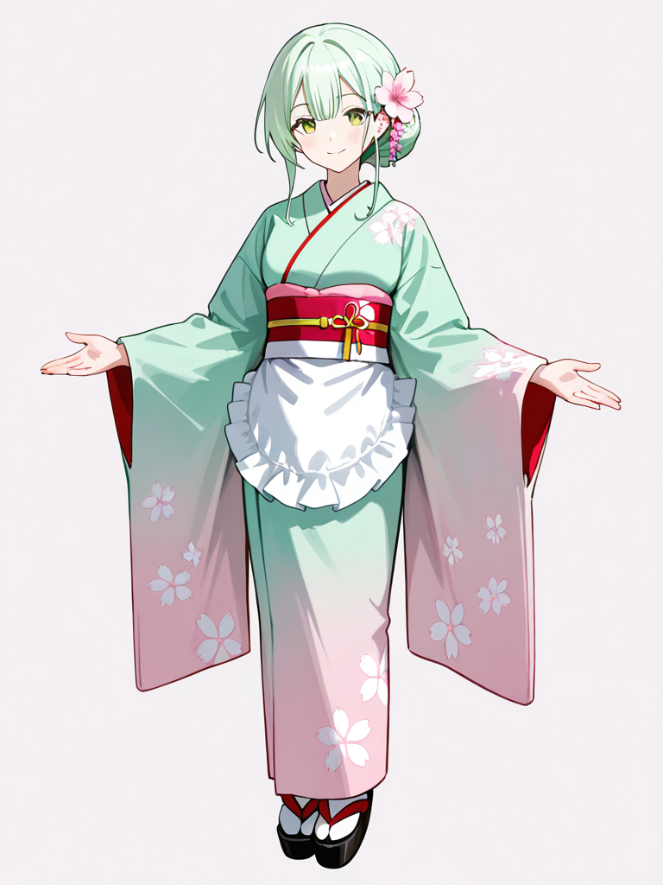
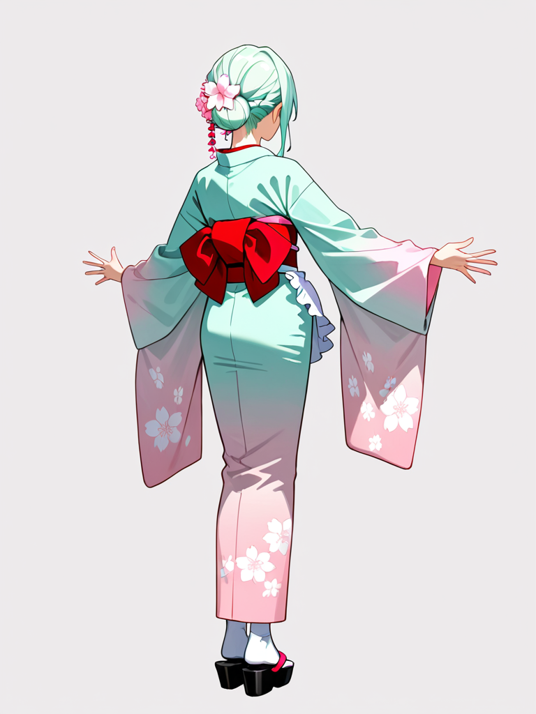
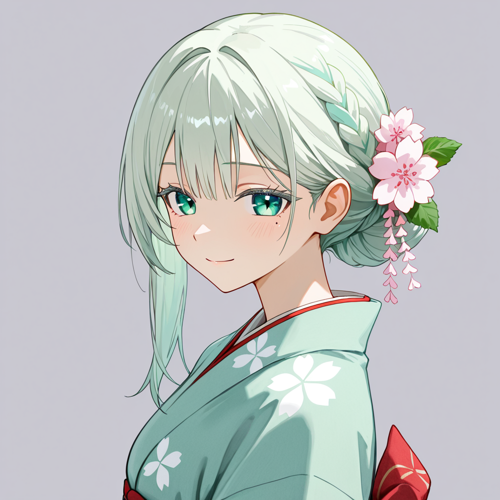

# Project Miyana - 雅凪

## 1. プロジェクト概要

miyana プロジェクトは、理想の女性キャラクター「雅凪（みやな）」を LoRA（Low-Rank Adaptation）で具現化する取り組み。

このプロジェクトの思想は以下の通り：

- キャラクター造形の一貫性と高解像度な表現を両立する
- 特定のスタイルに一時的に依存しつつも、最終的には汎用性の高いキャラクター表現を目指す
- 技術的検証と芸術的探究の両立

### 🌸 雅凪のコンセプト概要

- **癒しを与える存在**
  雅凪はただの美しいキャラクターではなく、「見る者・接する者に心の安らぎを与える」ことが存在意義である。

- **包容力と静かな安心感**
  過剰に感情を表現せずとも、そこにいるだけで空気が和らぐような静けさを内包している。

- **共通するスタイル表現**
  控えめな色調の伝統的な着物、季節感を取り入れた桜モチーフ、日常性と優しさを補完するエプロン。

### 🧭 雅凪のコンセプト要素別整理

| 要素             | 内容                                                                                                       |
| ---------------- | ---------------------------------------------------------------------------------------------------------- |
| **存在意義**     | 癒し・安らぎ・包容。見る者・接する者の心をそっと解きほぐす存在であること。                                 |
| **感情表現**     | 柔らかな微笑、肯定的で静かなまなざし。過剰な表情変化は避け、感情は「静かに伝わる」かたちで現れる。         |
| **雰囲気**       | 緊張を解くような穏やかさ。気づけば隣にいてくれるような存在感で、過干渉でも放置でもないちょうどよさを持つ。 |
| **年齢感**       | 成人女性。少女ではないが、若々しさは残る。                                                                 |
| **服装**         | 伝統的な着物 + フリルのサロンエプロン。和風メイドを着物寄りにしたスタイル。                                |
| **髪型**         | まとめ髪ベース。控えめでありつつも品のある髪飾り                                                           |
| **彩色・トーン** | 優しく、淡く、温かい色調。派手なネオンカラー等は避ける                                                     |

> 📝 **備考**
> この定義は、LoRA 生成、プロンプト設計、NSFW 制御の各実験において基盤となる人格・世界観の指針である。
> 各構図・出力検証において、この定義と照らし合わせた評価を推奨する。

### コンセプトイメージ（暫定）

| 前面                                                  | 背面                                                 | クローズアップ                                                            |
| ----------------------------------------------------- | ---------------------------------------------------- | ------------------------------------------------------------------------- |
|  |  |  |

## 2. 開発戦略の柱

### チェックポイント選択の「回帰と段階的脱却」

- **初期段階: WAI-NSFW-illustrious-SDXL に回帰**
  - まずは「安定的に理想のスタイルに収束するが、（主に構図による） NSFW リスクのあるチェックポイント」を用い、構図の制約に向き合いながら LoRA を作り上げる
  - リスク管理: NSFW バイアス回避構図の知見の蓄積、NSFW 回避ネガティブプロンプトの整備
- **段階的脱却戦略**:
  - 作成した LoRA を利用して汎用寄りチェックポイントによる「理想のスタイル」「理想の属性を有した雅凪」が「自由な構図」で生成できるかの評価検証
  - 評価検証結果を次バージョンへフィードバック

### LoRA 分割戦略の推進

#### [重要!]「LoRA を作る楽しさ」と「LoRA の分割負荷」のバランス

最初から細かく LoRA 化するのではなく、段階的な分割により成功体験を積み重ねながら進める。作業の自動化やツールの活用も視野に入れる

#### 最終的に目指す分割 LoRA（草案）

- **ベース雅凪 LoRA の設計**: 顔の造形、骨格、体型、基本的な肌の質感など、「雅凪が雅凪であると認識される核」と、プロジェクトの基盤となる画風・品質を担います。シンプルな髪型（ボブ・ショート、セミロングなど）で学習素材を生成し、最適なものを選定します。
- **パーツ LoRA の設計**: ベース LoRA で安定しない、または複雑な要素（右サイドに流した髪、シニョン風の髪、桜のかんざしなど）は、個別の LoRA として学習します。
  - **学習素材**: 各パーツが際立つ多様な画像を収集・生成。
  - **アノテーション**: 属性マップを最大限活用し、タグの統一性と一貫性を確保。特定のパーツを強調するタグ付けと、位置情報タグ（`left_kanzashi` など）を積極的に使用。
- **スタイル LoRA の設計**: 特定の画風や雰囲気（`Illustrious-XL` など汎用チェックポイントと組み合わせることで、特定の画風を「上書き」する役割も期待）。学習は目標スタイルで描かれた多様な画像を集め、スタイルそのもののタグは付けず、トリガーワードで呼び出す。

#### プロンプト管理の深化と LoRA との連携

- **役割分担**:
  - **ベース LoRA**: キャラクターの核、汎用的な品質、基礎的な画風。
  - **スタイル LoRA**: 画風の詳細。
  - **パーツ LoRA**: 特定の局所的な要素を具現化。
  - **プロンプト**: 各 LoRA の呼び出しと重み付け、LoRA がカバーしない汎用属性の記述、ネガティブプロンプトによる抑制、最終的な微調整。属性マップとスタイルマップは、プロンプト生成のための「データベース」として機能。
- **トリガーワードの属性マップへの組み込み**: これは有効なアプローチであり、LoRA のトリガーワードと属性タグの役割分担、連携の最適化を具体的に検討しながら進めることになります。

#### 継続的な課題対応のアプローチ

- **NSFW 問題や左右非対称問題**: 開発段階で「今できる範囲」を探索しながら、段階的な解決を目指す
- **品質管理とテスト**: AI によるスクリーニングを最大限活用し、最終的なアートの品質は自身でジャッジ
- **コミュニティの活用**: Discord, Reddit, Civitai, Twitter など、画像生成 AI に関する情報交換が活発なコミュニティから情報収集や助言を得る

## 3. ロードマップ

### v3.x 系 - はじめての雅凪 LoRA 分割

#### v3.2 - 固定スタイルのベース雅凪 LoRA 作成

- **目的**：雅凪の「本質像」（人格、雰囲気、衣装、配色、質感、造形）を安定生成可能とする
- **アプローチ**：

  - `WAI-NSFW-illustrious-SDXL` に回帰し「プロンプトによる安定したスタイルが生成可能な環境」をベースとする（ただし NSFW リスクに注意）
  - 属性マップ・スタイルマップを活用した安定プロンプト設計
  - スタイルは固定。スタイルマップ上での記載は「default」とする。
  - 左右非対称要素（髪流し、髪飾り等）を一旦除外し、左右対称構成を基本とする
  - 各構図別の安定データセットを整備（ただし NSFW 構図は除外）
  - 属性マップ・スタイルマップを活用した LoRA 素材のアノテーション

- **成果**：
  - 安定した「固定スタイルベース雅凪」LoRA モデル
  - ベース LoRA モデル用の属性マップ
  - 固定スタイルたる「default」のスタイルマップ
  - 「default スタイル」 x 「各構図」をマージしたプロンプト群
  - LoRA 学習素材の画像及びアノテーションテキスト

#### v3.3 - パーツ LoRA による非対称表現の拡張

- **目的**：v3.2 で除外した左右非対称パーツ（髪飾り、サイドヘア等）を局所 LoRA で個別制御可能にする
- **アプローチ**：
  - パーツ単位のタグ設計・アノテーション整理
  - パーツ有無／左右位置が明確な素材の収集と抽出型選別
  - パーツ LoRA 学習（加算スロット型構造を前提とした補助学習）
- **成果**：
  - パーツ LoRA モデル
  - 各パーツに対応した属性マップ
  - 「パーツ」x「default スタイル」x「各構図」をマージしたプロンプト群
  - 「パーツごと」の LoRA 学習素材の画像及びアノテーションテキスト

#### v3.4 - 「ベース雅凪 LoRA」「パーツ LoRA」を用いた画像生成検証と LoRA へのフィードバック

- **目的**: 作成した LoRA が本来の用途である「画像生成モジュール」として有効に機能するかの検証
- **アプローチ**:
  - 雅凪の人物像にマッチした、様々なテーマ（一例: 桜の並木道をゆったりと散歩）の画像を生成し、 出力結果に違和感はないか、本来の目的を果たせているか等を分析
  - 分析結果をもとに、v3.x の設計思想の範疇で対応できるものは反映する開発の実施
- **成果**:
  - 雅凪の人物像にマッチした、様々なテーマの画像生成プロンプト
  - v3.x 設計思想の範囲で改善された「ベース」「パーツ」LoRA、及び学習素材群

### バックログ

構想はあるが、現段階のナレッジ・経験値ではロードマップに組み込めない開発要素

#### 汎用性拡張

- **目的**：スタイル間の汎用性を追求した LoRA へ進化（詳細は開発戦略参照）
- **アプローチ**：
  - ベース LoRA のさらなる汎用化（スタイルや服装の抽象化等）
  - スタイル LoRA の検証・開発
  - パーツ LoRA の細分化
  - 多スタイル対応プロンプト設計
  - スタイル調整タグの実験と評価
  - 複数構図・複数表現の学習素材追加

#### 汎用化と公開展開

- **目的**：誰もが自由に「雅凪」を使える環境を提供
- **アプローチ**：
  - モデルアーキテクチャの多様化（XL、Turbo、SD1.5 対応など）
  - モデル API 経由の活用（例：Web UI、Discord Bot、画像生成 API）

## 4. Markdown Table を利用したマトリクス形式のプロンプト管理

本プロジェクトでは、画像生成プロンプトの管理と再利用性を高めるため、「プロンプトのタグ」を「マトリクス形式」で管理している。

管理する軸は 2 種類存在する

- 属性軸 -> 人物の外見的特徴（髪型、顔の造形、服装など）のタグや、背景指定のタグ
- スタイル軸 -> 出力する画像のスタイル（画風・塗り・線画・彩色・レンダリング手法など）のタグ

属性軸を管理するマトリクスを「属性マップ」と呼び、スタイル軸を管理するマトリクスを「スタイルマップ」と呼ぶ。

#### 属性マップの場所

- [ポジティブプロンプト用](src/attribute_map/positive.md)
- [ネガティブプロンプト用](src/attribute_map/negative.md)

#### スタイルマップの場所

- [ポジティブプロンプト用](src/style_map/positive.md)
- [ネガティブプロンプト用](src/style_map/negative.md)

### 4.1 属性マップについて

プロンプトで表現されるべき「属性タグ」は「構図によって異なる」
例えば「帯の背面の結びの造形をしめすタグ」は「後方の構図からは必要」だが「前面の構図からは不要」だ。

つまり、属性マップのマトリクスは「属性タグ」x「構図」の組み合わせのテーブルとなる。

具体例を以下に示す

```md
### 🧍‍♀️ ポーズ・構図

| 日本語名         | タグ名               | front | back | left-side | close-up |
| :--------------- | :------------------- | :---- | :--- | :-------- | :------- |
| 立っている       | standing             | o     | o    | o         | o        |
| 何も持っていない | not holding anything | 1.2   | 1.2  | 1.2       | x        |

### 💇‍♀️ 髪型・髪色

| 日本語名                   | タグ名                | front | back | left-side | close-up |
| :------------------------- | :-------------------- | :---- | :--- | :-------- | :------- |
| ミルキーミントグリーンの髪 | milky mint green hair | 1.3   | 1.3  | 1.3       | 1.3      |
| 淡いミントの色合い         | pale mint shade       | o     | o    | o         | o        |
```

### 4.2 スタイルマップについて

プロンプトで表現されるべき「スタイルタグ」は「スタイル」によって異なる。
例えば、「水墨画スタイル」には「毛筆の線タグ」が必要だろう。一方「トゥーン風スタイル」には「フラットな塗りタグ」が必要かもしれない。

つまり、スタイルマップのマトリクスは「スタイルタグ」x「スタイル」の組み合わせのテーブルとなる

具体例を以下に示す

```md
### 品質・品質制御

| 日本語名 | タグ名       | default | toon |
| -------- | ------------ | ------- | ---- |
| 傑作     | masterpiece  | o       | o    |
| 最高品質 | best quality | o       | o    |

### 雰囲気・印象

| 日本語名         | タグ名       | default | toon |
| ---------------- | ------------ | ------- | ---- |
| 洗練された雰囲気 | refined aura | 1.2     | x    |
| 優雅             | graceful     | o       | x    |
```

### 4.3 マトリクスのフォーマット

フォーマットはいずれのマップも一緒である

- **日本語名** の列: プロンプトタグの日本語での意味や概念。
- **タグ名** の列: 実際に画像生成 AI のプロンプトとして使用する英単語またはフレーズ。この列には重み付けの数値（例: :1.3）は含まない。重み付けの具体的な数値は、各「スタイル」/「構図」の列に記載されます。
- **各スタイル/構図の列**: 各構図パターンや特定のスタイルに対応する列（例: `front`, `v3.1.2`, `test` など）。これらのセルには以下の値が設定される。
  - `o` : その構図/スタイルでタグを使用する場合。
  - `x` : その構図/スタイルでタグを**使用しない**場合（意図的に除外する場合、または**その構図/スタイルにおいて定義されていない・該当しない場合**）。
  - `1.2` などの数値: 重み付けをする場合の具体的な数値。タグ名に重み付けが含まれる場合は、ここにその数値を記載。

### 4.4 「###ヘッダ」によるマトリクスのカテゴライズ

ヒューマンリーダブルを高めるために、マトリクスを一定のカテゴリに分類し、テーブルの上に表記する。

カテゴリの分類について今のところ明確なルールは無いが、作業者間のコミュニケーションで調整する

### 4.5 その他細かいルール

#### マップ内の列は、すべてのマトリクスで完全一致とする

例えば「スタイルマップで NG な例」を示す

```md
### 品質・品質制御

| 日本語名 | タグ名       | default | toon |
| -------- | ------------ | ------- | ---- |
| 傑作     | masterpiece  | o       | o    |
| 最高品質 | best quality | o       | o    |

### 雰囲気・印象

| 日本語名         | タグ名       | default |
| ---------------- | ------------ | ------- |
| 洗練された雰囲気 | refined aura | 1.2     |
| 優雅             | graceful     | o       |
```

「雰囲気・印象」テーブルに toon 列が存在しない。これは NG である。

## 5. プロンプト出力ルール

属性マップ、スタイルマップから抽出された各種タグは以下の順番で出力する。

1. スタイルマップ
2. 属性マップ

### プロンプトのフォーマット

ヒューマンリーダブルを保つため、以下のルールとする

- 各タグは 1 行ごとに記述し、行末にはカンマを付ける
- Markdown 上でヘッダとして定義されている「カテゴリ名」は、タグ情報以外はプロンプトには含めない（ツールがタグと誤認するリスクを避けるため）
- 代わりに、カテゴリ単位で 1 行の空行を挿入し、視認性を確保する

### 例

#### GOOD

```
masterpiece,
best quality,

(refined aura:1.2),
graceful,

standing,
(not holding anything:1.2),

(milky mint green hair:1.3),
pale mint shade,
```

#### NG

```
# 🧍‍♀️ ポーズ・構図
standing,
(not holding anything:1.2),

# 💇‍♀️ 髪型・髪色
(milky mint green hair:1.3),
pale mint shade,

# 品質・品質制御
masterpiece,
best quality,

# 雰囲気・印象
(refined aura:1.2),
graceful,
```

NG な理由:

- 出力順が「属性マップ」->「スタイルマップ」の順になっている
- タグ以外の情報（Markdown 上でカテゴリとして表記されるラベル情報）が含まれている

#### GHA によるプロンプトの自動生成

「スタイル」x「構図」の組み合わせの全プロンプトは、github で pull request をトリガーとして GHA により自動作成され、workflow の artifact として保存される。

see: [workflow](.github/workflows/generate_prompts.yml)

## 6. 成果物の保存

各バージョンの作業完了時 [artifacts](./artifacts) 以下を保存しておく

- スタイル・属性マップの指定により出力されたプロンプト(GHA で作成されたものを添付)
- 実際に生成された画像数点
